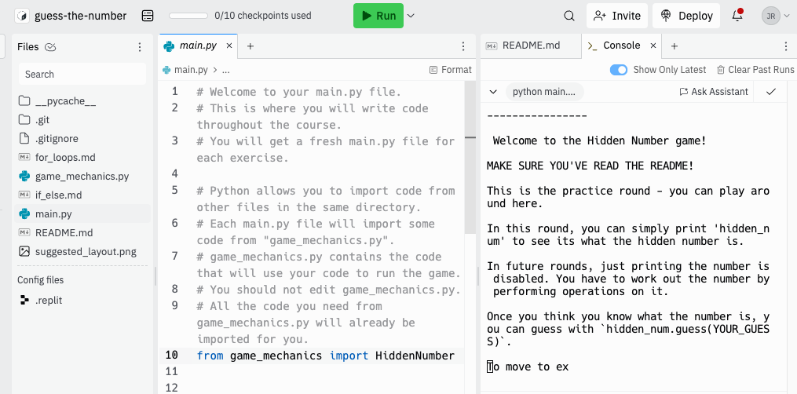

## Introduction 

Replit is where we will be writing our Python code for this course.

You should see a file browser on the left hand side.

Open main.py. throughout the course, this is the only file you'll write code in. You can ignore the rest (apart from the .md files which contain instructions).

You will also need the Console. This is where you'll see the output of your code.

If you can't see a Console, click the three dots on the right hand side of the screen. Click "Add Pane" > "Insert Right". Then search "Console" and click it to add it.

I suggest you layout your windows like this. So you can see the code and easily switch between the Console and the README.


Please close all AI assistant windows. They are useful in real life but will prevent you from learning in this course. Also please turn off AI auto-complete by clicking the small "AI" button on the bottom left of the screen.




Click the run button at the top to run your code!

## General Basics of Code

To set a variable:
```python
x = 7
```

The value of `x` will now be `7` in your code.


In python, to see the value of a variable in your code you need to print them. The results of your print statements will be visible in you Console.

```python
x = 3
print(x)
```
You will see 3 appear in your Console.

 Lines starting with a `#` are **comments** - these aren't code and **don't run**! E.g.
```python
# Comments are useful to explain code to others in files :)
```

## Instructions


In Exercise 0 you can simply print the value of `hidden_num` to see it.

```python
print(hidden_num)
```

This functionality is disabled from exercise 1 onwards, otherwise the game wouldn't be much fun!


**Exercises 1 onwards**

Work out the hidden number using Python *operators*
(such as `+`, `-` and `*`) in the Console. The hidden number is
chosen randomly between 1 and 100 (inclusiveClick the run button at the top to run your code!) each round.

**In each exercise you only have some operators available to use!**

To start exercise `1`: (change the value of the variable `exercise_number`)

```python
exercise_number = 1
hidden_num = HiddenNumber(exercise_number=exercise_number)
```

Here, `hidden_num` (you can call this variable what you like!) is a hidden number
between `1` and `100`, which you have to work out in the console and guess! :)

To make a guess at `hidden_num` (we're guessing it's `77` below), run:
```python
hidden_num.guess(77)
```

You don't want to guess randomly - that'll take forever! So for each exercise we're enabling certain operators (e.g. addition `+`, subtraction `-` etc) which you can use to work out what it is!

E.g. this will print out the number 5 higher than the hidden number ;)
```python
new_num = hidden_num + 5
print(new_num)
```

**Struggling??** Use this to get a hint!

```python
hidden_num.hint()
```


## Further documents

For the final 2 exercises, it'll help to know how to use `for` loops.
Open `for_loops.md` to learn more about them. Probably it's best to ignore these documents until you get to the final two exercises, as by this point hopefully the basics will make sense.


There is also `if_else.md`. This is only needed for the extension exercise. But you will need them at some point in the course, so it's worth reading through this after you've done the exercises.